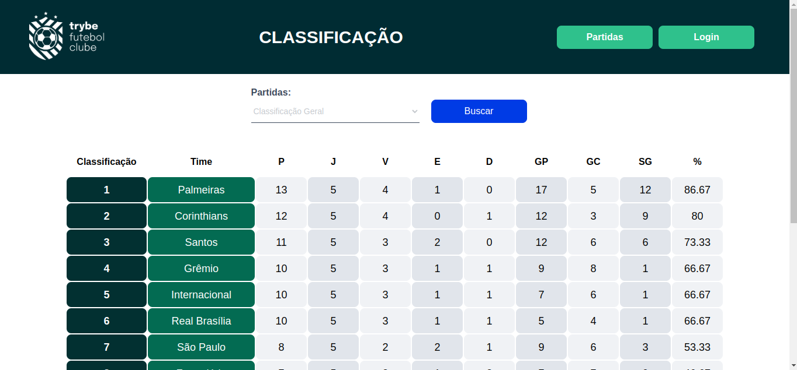

<p align="center">
  
</p>
<hr />
<p align="center">
  Projeto desenvolvido durante o módulo de back-end no curso da trybe
</p>
<br>

## 📋 Sobre
O projeto consiste em desenvolver uma REST API utilizando a arquitetura MSC(Model-Service-Controller) e com testes unitários, para o gerenciamento de partidas e times de futebol.



## ✨ Funcionalidades
- Logar com email e senha
- Visualizar as partidas 
- Aplicar filtros nas partidas
- Visualizar o leaderboard com estatísticas dos times
- Aplicar filtros ao leaderboard
- Ao logar como administrador, você pode realizar o CRUD de times e partidas

## 💻 Tecnologias


## 🧠 Aprendizados
- Utilizar Typescript juntamente com NodeJs e Express
- Utilizar o padrão POO para o desenvolvimento de uma API

## 📦 Rodando o projeto

**_Você precisará do docker-compose instalado_**

Instale as dependências
```bash
npm run install:apps
```
Rode os containers
```bash
npm run compose:up:dev
```
